# 契审智控｜AI 采购合同审核平台 - PRD 需求规格说明书 V3.0

> 文档版本：V3.0  ｜  编写日期：2026-07-05  ｜  状态：已实现阶段 2（真实 AI + 真实后端）
> 文档定位：**带系统截图、页面元素说明、交互逻辑、业务流程的完整产品需求规格说明**
> 适用范围：AI 产品经理求职作品集展示、项目交接说明、二次开发参考
> 与 V2.0 差异：V2.0 描述第一阶段 Mock 实现；V3.0 补充阶段 2 真实 AI 接入（DeepSeek + Supabase + Playwright PDF）后的全部能力，并完善每页元素清单与交互逻辑

---

## 目录

- [一、产品概述](#一产品概述)
- [二、角色与权限](#二角色与权限)
- [三、技术栈](#三技术栈)
- [四、统一规范](#四统一规范)
- [五、全局布局](#五全局布局)
- [六、页面清单与路由](#六页面清单与路由)
- [P01 登录页](#p01-登录页)
- [P02 工作台](#p02-工作台)
- [P03 合同审核列表](#p03-合同审核列表)
- [P04 新建审核任务](#p04-新建审核任务)
- [P05 审核处理进度页](#p05-审核处理进度页)
- [P06 合同信息字段确认页](#p06-合同信息字段确认页)
- [P07 合同审核详情页](#p07-合同审核详情页)
- [P08 法务复核页](#p08-法务复核页)
- [P09 审核报告列表](#p09-审核报告列表)
- [P10 审核报告详情](#p10-审核报告详情)
- [P11 审核记录](#p11-审核记录)
- [P12 风险规则库](#p12-风险规则库)
- [七、核心业务状态机](#七核心业务状态机)
- [八、数据模型](#八数据模型)
- [九、后端 API 端点清单](#九后端-api-端点清单)
- [十、风险规则库](#十风险规则库)
- [十一、核心业务流程](#十一核心业务流程)
- [十二、演示主流程](#十二演示主流程)
- [十三、环境配置与启动](#十三环境配置与启动)
- [十四、当前阶段边界](#十四当前阶段边界)

---

## 一、产品概述

### 1.1 产品定位

**契审智控** 是一款面向企业采购合同审核场景的 AI 辅助审核平台。系统融合规则引擎与大模型语义分析，覆盖合同解析、字段抽取、风险识别、原文定位、修改建议、人工确认、法务复核、报告生成的完整闭环。

### 1.2 核心业务流程

```
上传合同 → 文档解析 → 字段抽取 → 规则引擎检查 → AI 语义审核
→ 风险原文定位 → 生成风险说明与修改建议 → 业务人员逐条处理
→ 提交法务复核 → 法务确认 → 生成审核报告 → 审核记录留档
```

### 1.3 当前实现阶段

| 维度 | 状态 |
|------|------|
| 前端 12 个页面 | ✅ 全部实现 |
| 真实 DeepSeek AI 接入 | ✅ 已接入（字段抽取 + 风险审核） |
| 真实 Supabase 后端 | ✅ 已接入（Postgres + Auth + Storage） |
| 真实文件解析 | ✅ pdfplumber / python-docx / mammoth |
| PDF 报告生成 | ✅ Playwright 无头 Chromium（视觉与网页一致） |
| 浏览器打印导出 | ✅ 兜底方案 |
| OCR 扫描件支持 | ❌ 不支持（仅文字型 PDF） |
| Word 红线修订导出 | ❌ 未实现 |
| 电子签章 / 复杂审批流 | ❌ 未实现 |
| 履约管理 | ❌ 未实现 |

### 1.4 系统免责声明

> 本系统审核结果由 AI 辅助生成，仅供合同初审参考，不构成正式法律意见，最终结论应由专业人员确认。

免责声明展示位置：登录页底部、全局左侧导航底部、审核进度页底部、审核报告详情页底部。

---

## 二、角色与权限

### 2.1 角色定义

| 角色 | 标识 | 演示账号 | 主要职责 |
|------|------|----------|----------|
| 采购业务人员 | `purchaser` | `purchaser@qszk.com` / `123456` | 发起审核、处理风险、提交复核 |
| 法务审核人员 | `legal` | `legal@qszk.com` / `123456` | 法务复核、修改建议、出具结论 |
| 系统管理员 | `admin` | `admin@qszk.com` / `123456` | 全部权限 + 规则库管理 |

### 2.2 权限矩阵

| 功能 | purchaser | legal | admin |
|------|:---------:|:-----:|:-----:|
| 工作台 | ✅ | ✅ | ✅ |
| 新建审核 | ✅ | ❌ | ❌ |
| 查看审核列表 | ✅ | ✅（菜单名「合同复核」） | ✅ |
| 字段确认（编辑） | ✅ | 只读 | 只读 |
| 风险处理（接受/编辑/忽略/转人工） | ✅ | ❌ | ❌ |
| 提交法务复核 | ✅ | ❌ | ❌ |
| 法务复核操作 | ❌ | ✅ | ❌ |
| 生成报告 | ✅ | ✅ | ✅ |
| 规则库管理 | 只读 | ✅（只读+管理） | ✅ |
| 角色切换 | ✅ | ✅ | ✅ |
| 重置演示数据 | ✅ | ✅ | ✅ |

---

## 三、技术栈

### 3.1 前端技术栈

| 技术 | 版本 | 用途 |
|------|------|------|
| React | 18.3.1 | UI 框架 |
| TypeScript | 5.6.2（严格模式） | 类型安全 |
| Vite | 5.4.8 | 构建工具 |
| Ant Design | 5.21.6 | 唯一 UI 组件库 |
| @ant-design/icons | 5.5.1 | 图标 |
| React Router DOM | 6.27.0 | 路由 |
| Zustand | 4.5.5 | 状态管理 |
| ECharts + echarts-for-react | 5.5.1 / 3.0.2 | 图表 |
| dayjs | 1.11.13 | 时间处理 |
| lucide-react | 0.446.0 | 图标补充 |
| pdfjs-dist | 6.1.200 | PDF 原文渲染 |
| docx-preview + docx | 0.3.7 / 9.7.1 | DOCX 预览与导出 |
| tesseract.js | 7.0.0 | 前端 OCR 框架（生产路径未使用） |
| html2canvas + jspdf | 1.4.1 / 4.2.1 | 前端 PDF 导出兜底 |

### 3.2 后端技术栈

| 技术 | 版本 | 用途 |
|------|------|------|
| Python | 3.10+ | 运行时 |
| FastAPI | 0.115.6 | Web 框架 |
| uvicorn | 0.34.0 | ASGI 服务器 |
| pydantic | 2.10.4 | 数据校验 |
| openai SDK | 1.59.6 | 调用 DeepSeek（OpenAI 兼容） |
| pdfplumber | 0.11.5 | PDF 文本+表格解析 |
| PyMuPDF (fitz) | 1.24.10 | PDF 图片提取 |
| python-docx + mammoth | 1.1.2 / 1.9.0 | DOCX 解析 + HTML 转换 |
| reportlab | 4.2.5 | 结构化 PDF 报告 |
| playwright | 1.48.0 | 无头 Chromium 渲染网页为 PDF |
| supabase | 2.9.0 | Postgres + Auth + Storage |
| httpx | 0.27.2 | HTTP 客户端 |

### 3.3 数据持久化

- **真实模式**：Supabase Postgres（业务数据）+ Supabase Storage（合同原文件，bucket `contract-files`）+ IndexedDB（前端文件暂存）
- **Mock 模式**：localStorage 轻量数据层（样例合同走 Mock）
- **切换条件**：`.env` 中 `MOCK_MODE=auto`（默认），`DEEPSEEK_API_KEY` 未配置 → Mock；已配置 → 真实

---

## 四、统一规范

### 4.1 设计 Token

| Token | 色值 | 用途 |
|-------|------|------|
| primary | `#1677ff` | 主色 专业蓝 |
| ai | `#13c2c2` | AI 辅助色 青绿 |
| bg | `#f5f7fa` | 背景 浅灰白 |
| card | `#ffffff` | 卡片背景 |
| border | `#e8ecf0` | 边框 |
| textPrimary | `#1d2129` | 主文字 |
| textSecondary | `#5b6470` | 次要文字 |
| high | `#f5222d` | 高风险 红 |
| medium | `#fa8c16` | 中风险 橙 |
| low | `#52c41a` | 低风险 绿 |
| notice | `#7c8696` | 提示项 蓝灰 |

### 4.2 风险等级映射（全局唯一）

| 值 | 中文 | 色值 | 背景色 | 含义 |
|----|------|------|--------|------|
| high | 高风险 | `#f5222d` | `#fff1f0` | 必须人工确认，未处理不得生成报告 |
| medium | 中风险 | `#fa8c16` | `#fff7e6` | 建议处理 |
| low | 低风险 | `#52c41a` | `#f6ffed` | 可批量处理 |
| notice | 提示项 | `#7c8696` | `#f0f5ff` | 不阻断流程 |

### 4.3 审核任务状态（全局唯一）

`draft` 草稿 / `parsing` 解析中 / `ai_reviewing` AI审核中 / `pending_business` 待人工确认 / `pending_legal` 待法务复核 / `completed` 已完成 / `failed` 失败

### 4.4 风险处理状态（全局唯一）

`pending` 待处理 / `accepted` 已接受 / `edited` 已编辑 / `ignored` 已忽略 / `manual_review` 转人工复核 / `confirmed` 已确认

### 4.5 通用规范

- 主色蓝 + AI 青绿辅助；浅色背景；企业级 B 端 SaaS 风格
- 1366×768 核心内容可用，三栏审核页不出现横向滚动
- 所有按钮三种归宿：真实执行 / 跳真实页面 / 明确提示「当前版本暂未开放」
- 关键操作：表单校验、成功/失败提示、二次确认、加载态、防重复提交、空/错状态
- 表单防抖 300ms；列表筛选写 URL；危险操作二次确认
- 风险明细表网页端不出现左右滚动条，内容自动换行不省略
- 返回按钮统一在左上角
- 所有显示时间统一 `YYYY-MM-DD HH:mm:ss` 格式
- 乐观更新 + 失败回滚（风险处理、法务复核）
- 列宽可调（`ResizableTable`），列宽持久化 localStorage

---

## 五、全局布局

**文件**：`src/layouts/MainLayout.tsx`  ｜  **截图**：见各页面截图左侧导航

### 5.1 整体结构

- 左侧固定侧边栏（Sider，宽 220px，可折叠，断点 lg）
- 顶部工具栏（Header，高 56px，sticky）
- 主内容区（Content，padding 20px）

### 5.2 侧边栏元素

| 元素 | 内容 |
|------|------|
| Logo | `/logo.svg` 图标（28×28）+ "契审智控" 主标题 + "AI采购合同审核" 副标题 |
| 菜单项（按角色动态构建） | 工作台（`/dashboard`）、合同审核（`/reviews`）、审核报告（`/reports`）、风险规则库（`/rules`） |
| 采购人员额外菜单 | "新建审核"（`/reviews/new`）插在第 2 位 |
| 法务角色菜单差异 | "合同审核"变为"合同复核"（图标改为 Scale） |
| 底部免责声明 | 黄色背景卡片（`#fffbe6`），展示 DISCLAIMER 全文 |

### 5.3 顶栏元素

| 元素 | 内容/行为 |
|------|----------|
| 折叠按钮 | PanelLeftClose/Open 图标按钮，控制侧边栏折叠 |
| "AI 辅助" 标签 | 青绿色 Tag，Tooltip 提示"AI 辅助审核" |
| 角色描述 | 当前用户角色 desc 文本 |
| 用户菜单（Dropdown） | 头像（首字母）+ 姓名 + 角色标签 + ChevronDown |
| 用户菜单-切换演示角色 | purchaser / legal / admin 三个角色，当前角色标记"当前"Tag；切换后刷新页面到 `/dashboard` |
| 用户菜单-重置演示数据 | 调用后端 `/api/data/seed` + resetDemoData()，刷新页面 |
| 用户菜单-退出登录 | 二次确认弹窗，logout 后跳 `/login` |

### 5.4 浏览器标签页标题

通过 `useEffect` 根据 `location.pathname` 动态设置 `document.title`，覆盖：工作台/合同审核/新建审核任务/审核进度/字段确认/审核记录/审核详情/法务复核/审核报告/报告详情。

---

## 六、页面清单与路由

| 编号 | 页面名称 | 路由 | 文件 | 截图 |
|------|----------|------|------|------|
| P01 | 登录页 | `/login` | `LoginPage.tsx` | 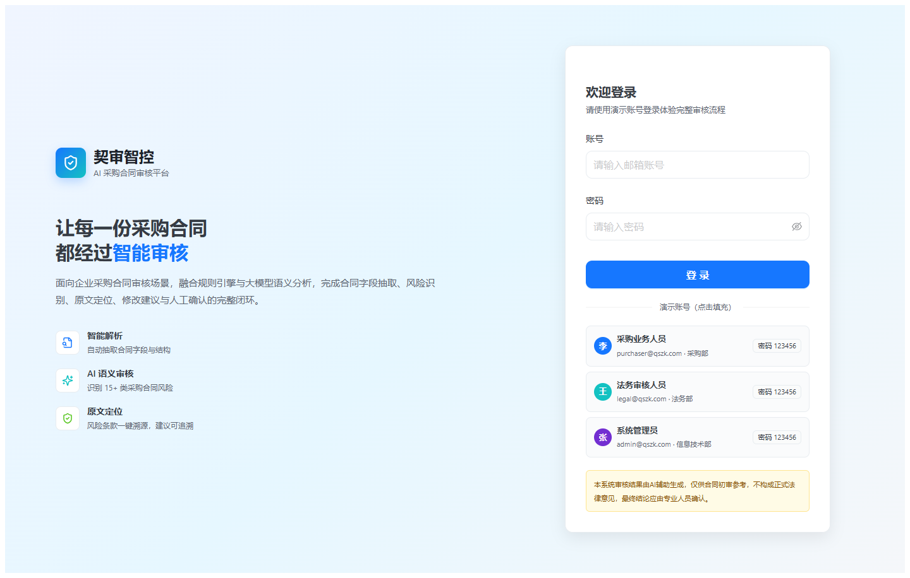 |
| P02 | 工作台 | `/dashboard` | `DashboardPage.tsx` | 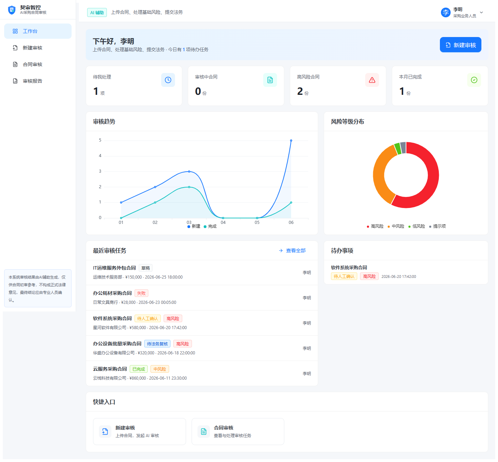 |
| P03 | 合同审核列表 | `/reviews` | `ReviewListPage.tsx` | 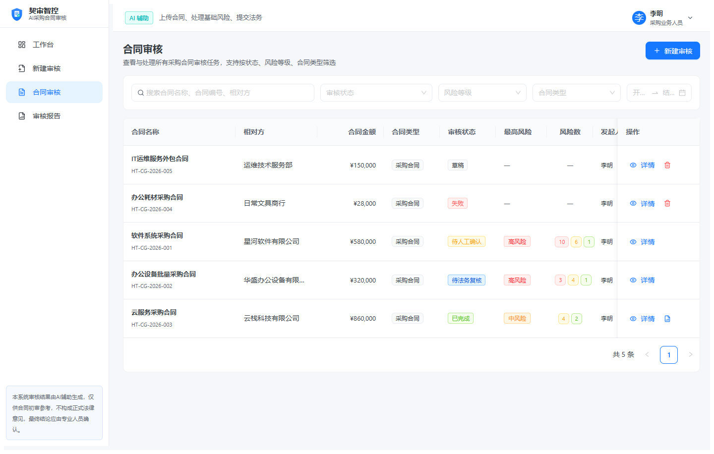 |
| P04 | 新建审核任务 | `/reviews/new` | `ReviewNewPage.tsx` | 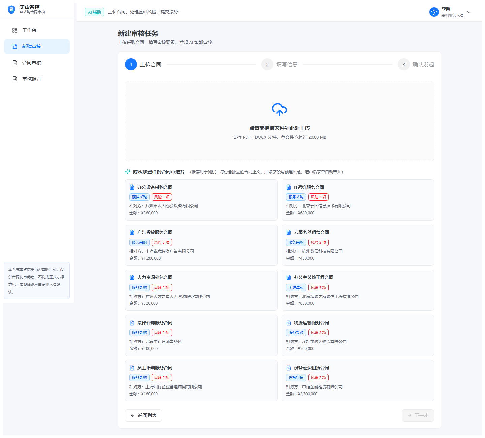 |
| P05 | 审核处理进度页 | `/reviews/:id/progress` | `ReviewProgressPage.tsx` | 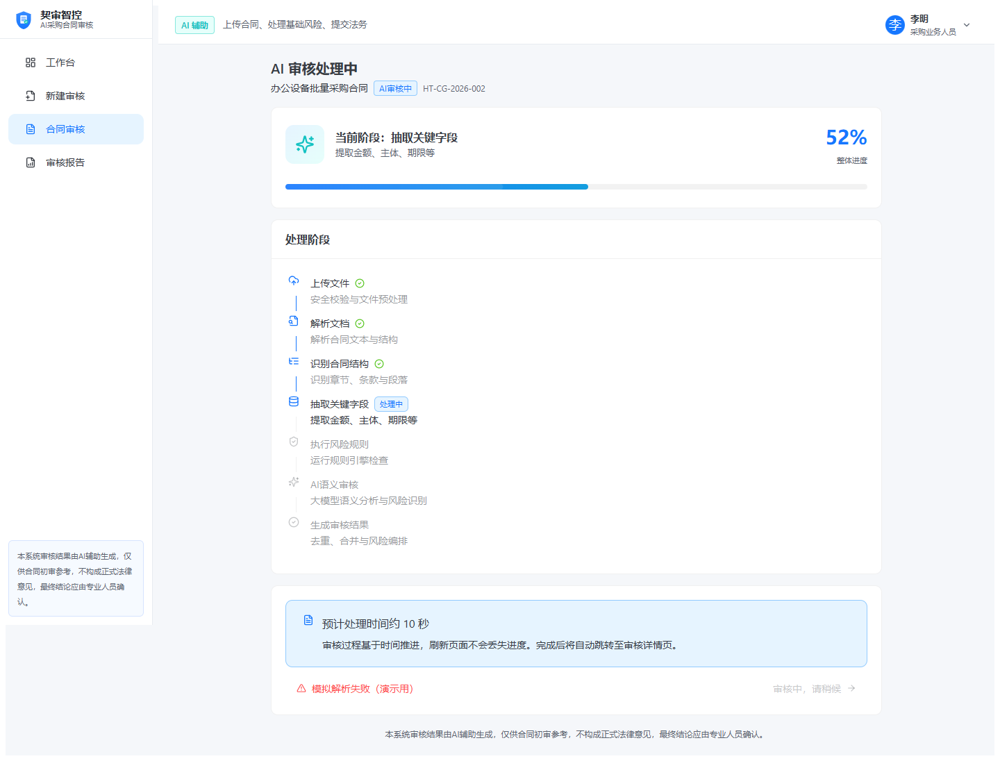 |
| P06 | 字段确认页 | `/reviews/:id/fields` | `FieldsConfirmPage.tsx` | 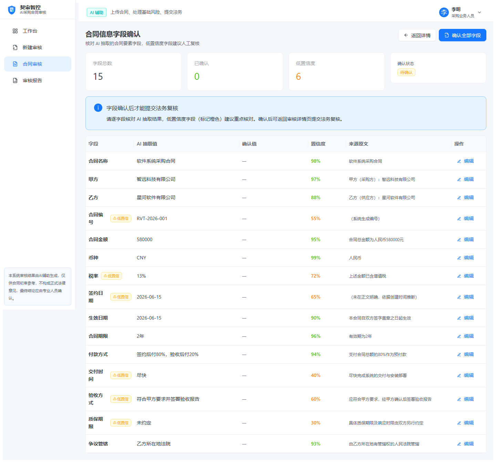 |
| P07 | 合同审核详情页 | `/reviews/:id` | `ReviewDetailPage.tsx` | 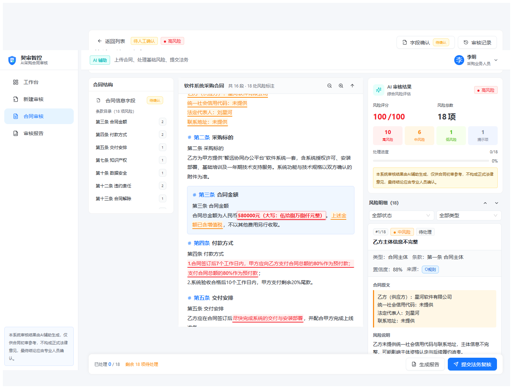 |
| P08 | 法务复核页 | `/legal-reviews/:id` | `LegalReviewPage.tsx` | 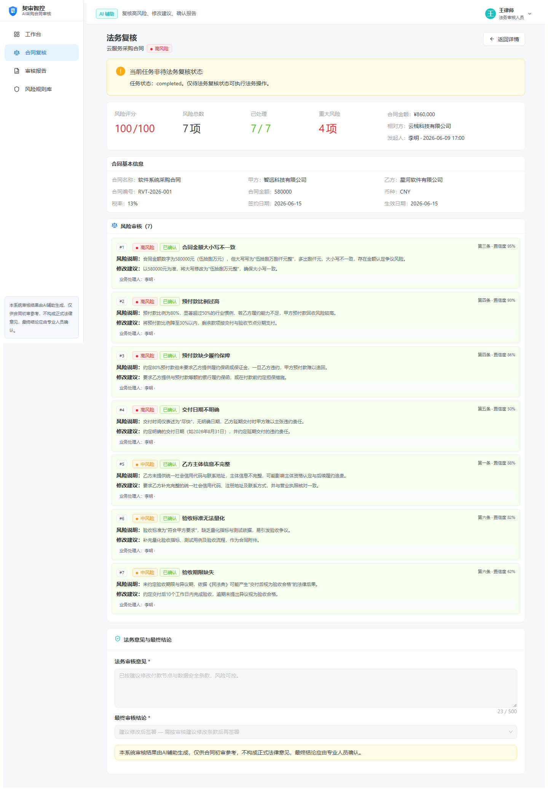 |
| P09 | 审核报告列表 | `/reports` | `ReportListPage.tsx` | 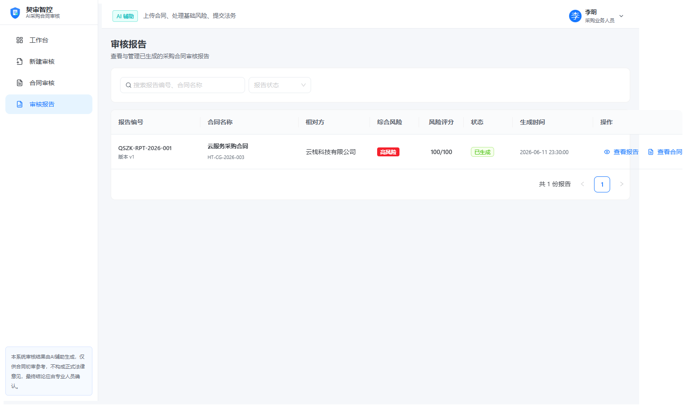 |
| P10 | 审核报告详情 | `/reports/:id` | `ReportDetailPage.tsx` | 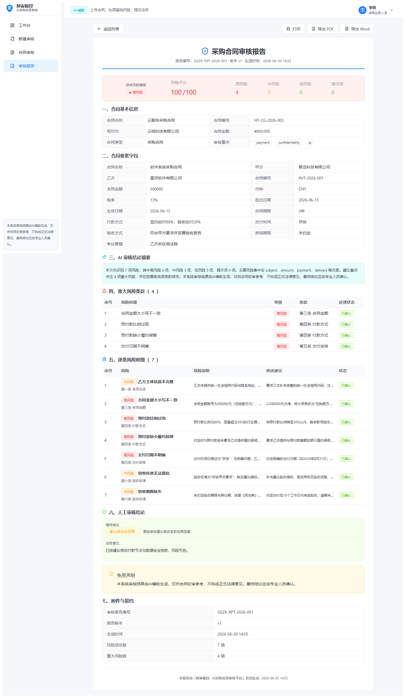 |
| P11 | 审核记录 | `/reviews/:id/history` | `ReviewHistoryPage.tsx` | 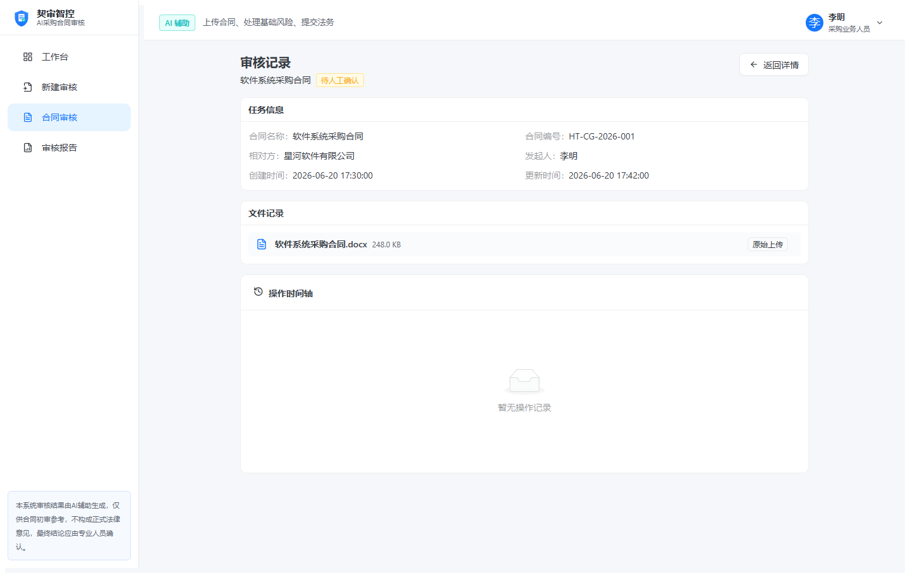 |
| P12 | 风险规则库 | `/rules` | `RuleListPage.tsx` | 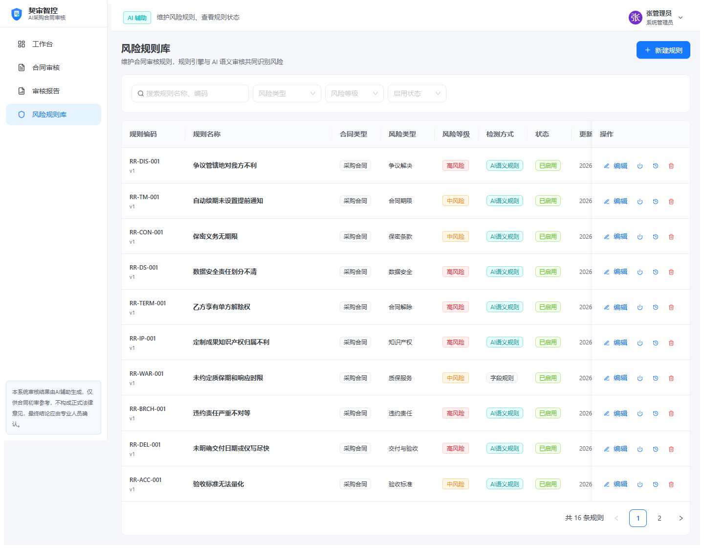 |

---

## P01 登录页

**路由**：`/login`  ｜  **访问条件**：未登录  ｜  **截图**：

### 页面元素

#### 左侧品牌介绍区

| 元素 | 内容 |
|------|------|
| Logo 区 | ShieldCheck 图标（48×48 渐变蓝绿背景）+ "契审智控" + "AI 采购合同审核平台" |
| 主标题 | "让每一份采购合同都经过智能审核"（"智能审核"蓝色高亮） |
| 简介 | 面向企业采购合同审核场景，融合规则引擎与大模型语义分析... |
| 特性列表 | 3 项：智能解析（FileSearch）/ AI 语义审核（Sparkles）/ 原文定位（ShieldCheck） |

#### 右侧登录卡片区（宽 420px）

| 元素 | 校验/说明 |
|------|----------|
| 标题 | "欢迎登录" + 提示"请使用演示账号登录体验完整审核流程" |
| 账号 Input | required + email 格式校验 |
| 密码 Input.Password | required |
| 登录按钮 | 主按钮、block、loading 态、高度 44 |
| 演示账号列表 | 来自 `DEMO_ACCOUNTS` 常量；每条含头像首字母圆/角色标签/email·部门/密码 Tag；点击自动填充账号密码 |
| AI 免责声明 | 黄色背景框（`#fffbe6`），DISCLAIMER 文本 |

### 交互逻辑

| 交互 | 行为 |
|------|------|
| 点击演示账号卡片 | `fillAccount(email, password)` 写入表单并高亮选中边框（蓝色边框 + 浅蓝背景） |
| 提交登录 | `useAuthStore.login` 调用后端 `POST /api/auth/login`；成功 `message.success` + 跳转 `/dashboard`；失败 `message.error` |
| 登录态校验 | 已登录用户访问 `/login` 自动跳转到 `/dashboard` |
| 路由守卫 | 未登录访问受保护路由自动跳转到 `/login` |

### 校验规则

- 账号：必填，邮箱格式
- 密码：必填
- 错误账号密码提示：「账号或密码错误，请使用演示账号登录」

---

## P02 工作台

**路由**：`/dashboard`  ｜  **访问条件**：已登录  ｜  **截图**：

### 页面元素

#### 欢迎信息条（Card 渐变背景）

| 元素 | 内容 |
|------|------|
| 问候语 | 按小时数：早上好 / 上午好 / 中午好 / 下午好 / 晚上好 + 用户姓名 |
| 副信息 | 角色描述 + "今日有 X 项待办任务" |
| 新建审核按钮 | 仅 purchaser 角色显示，跳 `/reviews/new` |

#### 4 个指标卡（点击跳转，hoverable）

| 指标 | 含义 | 跳转目标（按角色区分） |
|------|------|----------------------|
| 待我处理 | 当前用户待处理任务数 | purchaser: `?status=pending_business&creator=me`；legal: `?status=pending_legal`；admin: `?status=pending_business,pending_legal` |
| 审核中合同 | AI 审核中任务数 | `/reviews?status=ai_reviewing` |
| 高风险合同 | 含高风险等级的合同数 | `/reviews?riskLevel=high` |
| 累计完成 | 累计完成任务数 | `/reviews?status=completed` |

#### 图表区

| 卡片 | 列宽 | 内容 |
|------|------|------|
| 审核趋势（折线图） | 14 列 | 新建/完成两条线，X 轴月份，使用 ECharts |
| 风险等级分布（饼图） | 10 列 | 按 riskLevels（含 color），含 Tooltip 解释"统计所有审核任务中识别出的风险项总数" |

#### 列表区

| 卡片 | 列宽 | 内容 |
|------|------|------|
| 最近审核任务 | 14 列 | List 展示 recentTasks，每项：合同名 + 状态Tag + 风险Tag + 相对方/金额/时间 + 创建人；点击跳 `/reviews/{id}`；extra "查看全部" |
| 待办事项 | 10 列，最多 6 条 | List 展示 todos；点击按角色跳转：legal 且 pending_legal → `/legal-reviews/{id}`，否则 `/reviews/{id}` |

#### 快捷入口（按角色过滤）

| 入口 | 角色范围 |
|------|---------|
| 新建审核 | purchaser |
| 合同审核 | purchaser / legal / admin |
| 法务复核 | legal |
| 风险规则 | legal / admin |

### 数据逻辑

- 所有数据来自 `dashboardService.loadAll`，与列表、详情同源
- 指标卡数据由 `db.getTasks()` 实时计算，不缓存
- 趋势数据为最近 6 个月聚合
- 风险分布基于所有任务的风险项聚合

---

## P03 合同审核列表

**路由**：`/reviews`  ｜  **访问条件**：已登录  ｜  **截图**：

### 页面元素

#### PageHeader

| 元素 | 内容 |
|------|------|
| 标题 | "合同审核" |
| 描述 | "查看与处理所有采购合同审核任务，支持按状态、风险等级、合同类型筛选" |
| 新建审核按钮 | 仅 purchaser 角色，跳 `/reviews/new` |

#### 筛选区（URL 同步）

| 元素 | 说明 |
|------|------|
| 关键词 Input | 搜索"合同名称、编号、相对方、类型、发起人、部门、备注" |
| 审核状态 Select | 多选，maxTagCount responsive |
| 风险等级 Select | 多选 |
| 合同类型 Select | 单选（5 类：软件/硬件/服务/系统集成/设备租赁） |
| 创建时间 RangePicker | |
| 重置按钮 | 仅 hasFilter 时显示 |
| Alert 提示 | 当 URL `creator=me` 时显示"当前仅展示您创建的任务" |

#### 表格列（ResizableTable，支持列宽调整，storageKey="reviews"）

| 列名 | 宽度 | 内容 |
|------|------|------|
| 合同名称 | 220, fixed:left | 合同名（加粗）+ 编号（灰色小字） |
| 相对方 | 160 | ellipsis |
| 合同金额 | 130, align:right | formatMoney |
| 合同类型 | 110 | Tag |
| 审核状态 | 110 | ReviewStatusTag |
| 最高风险 | 100 | RiskLevelTag 或 — |
| 风险数 | 90, align:center | 高/中/低 Tag 分色展示 |
| 发起人 | 100 | |
| 更新时间 | 170 | formatDateTime |
| 操作 | 170, fixed:right | 详情/进度/复核 + 报告 + 删除 |

### 交互逻辑

| 操作 | 行为 |
|------|------|
| 点击行跳转 | `getNavigatePath(task)`：draft→`/reviews/{id}`；parsing/ai_reviewing→`/reviews/{id}/progress`；pending_business→`/reviews/{id}`；pending_legal 且 legal→`/legal-reviews/{id}`；completed→`/reviews/{id}`；failed→`/reviews/{id}/progress` |
| 查看报告 | 仅 completed 显示；查 `reportService.list`，有则跳 `/reports/{id}`，无则 `modal.confirm` 引导去详情 |
| 删除 | 仅 (draft/failed) 且 purchaser；`modal.confirm` 二次确认，danger 按钮；调 `reviewService.deleteTask` |
| 分页 | PAGE_SIZE、showSizeChanger、showQuickJumper、pageSizeOptions [10/20/50]、showTotal |
| 空状态 | hasFilter 时显示"清空筛选"，否则 purchaser 显示"新建审核" |

### 权限控制

- 新建审核按钮：purchaser
- 删除操作：(draft/failed) 状态 + purchaser
- 法务复核跳转：pending_legal + legal

---

## P04 新建审核任务

**路由**：`/reviews/new`（支持 `?draft={id}` 编辑草稿）  ｜  **访问权限**：仅 purchaser  ｜  **截图**：

### 页面元素

#### PageHeader

- 标题：草稿模式"编辑草稿任务"，否则"新建审核任务"

#### 步骤指示器（3 步）

| 步骤 | 标题 | 描述 |
|------|------|------|
| 0 | 上传合同 | PDF / DOCX |
| 1 | 填写信息 | 合同要素 |
| 2 | 确认发起 | 开始 AI 审核 |

#### 第一步：上传合同

| 元素 | 说明 |
|------|------|
| Upload.Dragger | accept=PDF/DOCX，maxSize 限制；校验格式与大小 |
| 已上传文件展示 | 文件图标 + 文件名 + 格式 Tag + 大小 + 替换/移除按钮 |
| 样例合同选择 | 2 列网格，每个样例：合同名 + 类型/风险数 Tag + 相对方 + 金额；选中后表单自动带入 |

#### 第二步：填写审核信息

| 字段 | 校验 |
|------|------|
| 合同名称 Input | required, maxLength 80, showCount |
| 合同类型 Select | required（5 类） |
| 我方身份 Radio | required: buyer 采购方(甲方) / seller 供应方(乙方) |
| 相对方 Input | required, maxLength 60 |
| 所属部门 Select | required（采购部/信息技术部/法务部/财务部/运营部/行政部） |
| 合同金额 InputNumber | required, min 0, step 1000 |
| 审核重点 Checkbox.Group | required, 2 列网格，8 类（合同主体/付款条款/交付与验收/违约责任/知识产权/保密与数据安全/合同解除/争议解决） |
| 补充说明 TextArea | 选填, rows 3, maxLength 300 |

#### 第三步：确认并发起

| 元素 | 内容 |
|------|------|
| 文件信息 Descriptions | 文件名/大小/格式 |
| 审核信息 Descriptions | 全部字段，审核重点以 Tag 展示 |
| Alert info | 样例合同提示 Mock 流程；上传合同提示调用 AI |
| Alert warning | AI 审核免责声明 |
| 返回修改按钮 | 回到第二步 |
| 保存草稿按钮 | 创建 draft 状态任务，跳转列表 |
| 开始 AI 审核按钮 | 创建任务并跳转进度页 |

### 交互逻辑

| 行为 | 流程 |
|------|------|
| 上传校验 | 非 PDF/DOCX 拒绝；超 maxSize 拒绝 |
| 选择样例 | `setSampleId` + 自动填充表单 |
| 保存草稿 | `createTask` 或 `updateTask`；非样例文件持久化到 IndexedDB（`useRealAIStore`） |
| 开始 AI 审核 | 真实 AI（手动上传 + 有 rawFile）：先 `checkBackendHealth`（冷启动提示 30-60 秒）→ `startRealAIReview`；样例合同：`startReview`；跳 `/reviews/{id}/progress` |
| 草稿回填 | draftId 模式：`getTask` + 从 IndexedDB 恢复 File 对象，直接进入第二步 |

### 关键路由判断

```
useRealAI = !sampleId && !!file?.rawFile
```
- **手动上传**：走真实 AI（DeepSeek + 真实文件解析）
- **样例合同**：走 Mock（预制的解析结果与风险项）

### 校验规则

- 文件格式：仅 PDF/DOCX
- 文件大小：≤ FILE_LIMITS.maxSize
- 表单：所有 required 字段
- 后端健康检查失败：`modal.error` 显示后端地址与排查建议

---

## P05 审核处理进度页

**路由**：`/reviews/:id/progress`  ｜  **访问条件**：已登录  ｜  **截图**：

### 页面元素

#### PageHeader

- 标题"AI 审核处理中"
- 描述：合同名 + 状态 Tag + 编号

#### 进度概览卡

| 元素 | 内容 |
|------|------|
| 大图标 | Sparkles（56×56 渐变背景） |
| 当前阶段文本 | "审核已完成"或"当前阶段：{label}" |
| 描述 | done 时"正在跳转..."，否则 stage.description |
| 进度百分比 | 大数字 + "整体进度" |
| Progress 条 | 渐变 primary→ai，done 时 status=success |

#### 处理阶段卡（Steps vertical, 7 阶段）

| 序号 | 阶段 key | 标签 | 图标 |
|------|---------|------|------|
| 1 | upload | 上传文件 | UploadCloud |
| 2 | parse | 解析文档 | FileSearch |
| 3 | structure | 识别结构 | ListTree |
| 4 | extract | 抽取字段 | Database |
| 5 | rule | 规则检查 | ShieldCheck |
| 6 | ai | AI 语义审核 | Sparkles |
| 7 | result | 生成结果 | CheckCircle2 |

每阶段状态：`waiting` / `processing` / `success` / `failed`，processing 显示"处理中"Tag，success 显示绿色对勾，failed 显示红色三角。

#### 底部卡（未完成时）

- Alert info：预计处理时间约 10 秒
- "模拟解析失败（演示用）"按钮（danger link）
- "查看结果"按钮（disabled，仅 done 后可用）

#### 完成提示卡

- CheckCircle2 + "AI 审核完成，共识别 X 项风险，正在跳转详情页..."
- 底部 DISCLAIMER

### 交互逻辑

| 行为 | 流程 |
|------|------|
| 轮询 | 600ms 定时器 `fetchProgress`；done 后清除定时器并 2 秒后跳 `/reviews/{id}` |
| 真实 AI 执行 | 检测到非样例任务且 status=parsing/ai_reviewing：从 `useRealAIStore` 取 File，调 `runFullAIReview`，onProgress 回调映射 7 阶段进度，完成后 `completeRealAIReview` + `refreshAccessToken` + 1 秒后 `fetchProgress` 触发跳转 |
| 文件丢失（刷新） | `failRealAIReview` + `message.error` |
| 重试 | 区分真实 AI / 样例合同，重新 `startRealAIReview` 或 `startReview` |
| 模拟失败 | `modal.confirm` → `reviewService.simulateFail` |
| 网络抖动 | 已有 result 时保留旧数据不覆盖，不显示整页错误 |

### 失败状态页

- Result error：subTitle 为 task.errorMsg
- "重新审核"按钮 + "返回列表"按钮
- Alert info：失败说明（任务编号、失败时间）

### 真实 AI 审核三步流程

通过 `runFullAIReview` 串联：
1. `POST /api/parse` → pdfplumber/python-docx 提取段落
2. `POST /api/extract-fields` → DeepSeek 抽取 15 字段（含置信度）
3. `POST /api/review-risks` → 规则引擎 + DeepSeek 识别 13 类风险

---

## P06 合同信息字段确认页

**路由**：`/reviews/:id/fields`  ｜  **访问条件**：已登录  ｜  **截图**：

### 页面元素

#### PageHeader（sticky，backUrl 详情页）

| 元素 | 内容 |
|------|------|
| 标题 | "合同信息字段确认" |
| 描述 | "核对 AI 抽取的合同要素字段，低置信度字段建议人工复核" |
| 右侧按钮 | purchaser: "确认全部字段"按钮（已确认后禁用并改文案）；其他角色：显示"已确认全部字段" Tag |

#### 4 个统计卡

| 卡片 | 内容 |
|------|------|
| 字段总数 | fields.length |
| 已确认 | confirmedCount（绿色） |
| 低置信度 | lowConfCount（>0 时橙色） |
| 确认状态 | "已确认"/"待确认" |

#### Alert info（未确认时）

"字段确认后才能提交法务复核" + 描述

#### 字段表格

| 列名 | 宽 | 内容 |
|------|----|------|
| 字段 | 140 | fieldLabel + 低置信 Tag（AlertTriangle 图标 + Tooltip） |
| AI 抽取值 | | 编辑态显示 Input，否则显示值或 — |
| 确认值 | 200 | 编辑态显示 保存/取消按钮；已编辑显示蓝色值 + "已编辑"Tag；已确认显示"已确认"Tag；否则 — |
| 置信度 | 110 | 百分比 + Tooltip，需复核橙色，否则绿色 |
| 来源原文 | ellipsis | Tooltip 显示完整 |
| 操作 | 100 | canEdit 时显示 编辑/保存 按钮，否则 — |

#### 字段清单（15 个）

合同名称、甲方、乙方、合同编号、合同金额、币种、税率、签约日期、生效日期、合同期限、付款方式、交付时间、验收方式、质保期限、争议管辖

### 交互逻辑

| 行为 | 流程 |
|------|------|
| 编辑字段 | `setEditingId` + `setEditValue`（默认 confirmedValue ?? fieldValue） |
| 保存 | `fieldService.update` + `loadData` |
| 确认全部字段 | `modal.confirm` 显示统计（总数/未确认/低置信）；有低置信时橙色提示；onOk 调 `fieldService.confirmAll` |
| 行样式 | 低置信未确认行添加 `low-confidence-row` 类 |

### 权限控制

- `canEdit = currentUser.role === 'purchaser'`
- 其他角色（legal/admin）只读查看，无编辑按钮

---

## P07 合同审核详情页

**路由**：`/reviews/:id`  ｜  **核心页面**  ｜  **截图**：

### 整体布局

三栏布局（lg 以上并排，以下垂直堆叠），高度 `calc(100vh - 56px - 40px)`，各栏独立滚动。

#### 顶部任务信息条（固定，sticky）

**第一行**：

| 元素 | 内容 |
|------|------|
| 返回按钮 | Link to `/reviews` |
| 状态 Tag | ReviewStatusTag |
| 最高风险 Tag | RiskLevelTag showDot |
| 合同名 | 大字加粗 ellipsis |
| 字段确认按钮 | Link to `/reviews/{id}/fields`，未确认显示"待确认"warning Tag |
| 审核记录按钮 | Link to `/reviews/{id}/history` |

**第二行**：编号 / 相对方 / 金额 / 更新时间 / 审核重点（小灰字）

### 左栏：合同结构与筛选（240px 固定）

| 元素 | 内容 |
|------|------|
| 字段确认入口 | Button type=text，未确认显示"待确认"Tag |
| 章节统计 | "合同章节（共 X 节 · Y 项风险）" |
| 章节列表 | 每项可点击滚动到段落，hover 高亮，风险数红色 Tag |
| 空状态 | "暂无合同结构" |

### 中栏：合同原文（ContractTextView 组件）

**渲染能力**：
- DOCX：`docx-preview` 渲染，风险用 `<mark>` 标签包裹（背景色 + 下划线 + 点击加深）
- PDF：`pdf.js` 渲染 textLayer，风险用绝对定位 overlay div 叠加
  - 默认半透明底色（rgba 0.22）+ `mix-blend-mode: multiply`，不遮挡文字
  - 激活态加深底色（rgba 0.45）+ 外框
  - 同一 span 只保留最高等级风险（避免颜色叠加错乱）
  - 多行风险原文按子句拆分匹配，避免行尾漏标
- 降级：原文渲染失败时切换到结构化段落视图（`ParagraphItem`）
- 表格风险：td 单元格用内联样式（backgroundColor + color），允许文字选择

**段落类型差异化样式**：

| 类型 | 样式 |
|------|------|
| title | 居中、fontSize+5、加粗、margin 20px 0 16px |
| header | 小字号、灰色背景、左边框 |
| image | 渲染 base64 图片 + 风险徽章 |
| body | 标准 + 去除"第一条 标题"前缀避免重复 |
| signature | 小字号、灰色背景、顶部留白 |

**工具栏元素**：

| 元素 | 行为 |
|------|------|
| 缩小按钮 | ZoomOut 调整 fontSize |
| 缩放比例显示 | 当前比例 |
| 放大按钮 | ZoomIn 调整 fontSize |
| 返回顶部按钮 | ArrowUp scrollToTop |
| 下载按钮 | Download 调 `generateDocxFromParagraphs` |
| 文件名显示 | 当前合同文件名 |

**风险高亮机制**：
- `splitSegments`：按高亮位置切分文本段
- `dedupHighlights`：重叠/包含时保留最高等级（重叠 > 35% 跳过）
- `titleHighlights` 与 `bodyHighlights` 分离（前缀去除时同步调整 start/end）
- 标题区域风险：取最高等级作为标题样式

### 右栏：AI 审核结果（380px 固定）

#### 综合信息卡

| 元素 | 内容 |
|------|------|
| 标题 | Sparkles 图标 + "AI 审核结果" |
| 最高风险 Tag | RiskLevelTag |
| 风险评分 | Statistic /100，颜色按最高风险等级 |
| 风险总数 | Statistic 项 |
| 4 格风险等级分布 | 高/中/低/提示 各色背景 |
| 处理进度 | Progress processed/total + 百分比条 |

#### 风险导航 + 筛选

| 元素 | 内容 |
|------|------|
| 风险明细计数 | "风险明细（X）" |
| 上一条/下一条按钮 | ChevronUp/Down，基于 filteredRisks 循环 |
| 章节筛选 Select | 全部章节 + parsedDoc.sections |
| 等级筛选 Select | 全部等级 + RISK_LEVEL_OPTIONS |
| 状态筛选 Select | 全部状态 + 7 种状态 |
| 类型筛选 Select | 全部类型 + RISK_CATEGORY_OPTIONS |
| 清空按钮 | 任一筛选非 all 时显示 |

#### 风险卡片列表（RiskCard 组件）

每张卡片包含：

| 区域 | 元素 |
|------|------|
| 头部 | #序号/总数 Tag + RiskLevelTag + RiskStatusTag + 低置信 Tag（warning + AlertTriangle + Tooltip）+ 风险标题 |
| 元信息条 | 类型 / 条款（clauseNumber + clauseTitle）/ 置信度（百分比，低置信橙色）/ 来源（rule/ai/manual Tag + 关联规则链接跳 `/rules?keyword={ruleId}`） |
| 合同原文 | 灰色背景 + 左侧等级色边框，>300 字截断 + "展开/收起" |
| 风险说明 | 加粗标签 + Paragraph |
| 审核依据 | 灰色小字 |
| 修改建议 | 绿色背景（已编辑蓝色），含"已编辑"Tag |
| 操作记录摘要 | 处理人 + 说明（如有） |
| 操作按钮区 | 见下表 |

**操作按钮（按状态）**：

| 状态 | 按钮 |
|------|------|
| pending | 接受建议（primary）/ 编辑建议 / 忽略 / 转人工 |
| accepted/edited/ignored/manual_review | 恢复处理 |
| 任意 | 添加备注（type=text） |

**弹窗**：

| 弹窗 | 内容 |
|------|------|
| 编辑建议 Modal | TextArea 编辑 suggestion（必填） |
| 忽略 Modal | Select 忽略原因（IGNORE_REASONS 5 项）+ TextArea 说明（必填） |
| 转人工 Modal | TextArea 转人工说明（必填） |
| 备注 Modal | TextArea 备注（必填） |

**选中态样式**：
- 边框：active ? levelCfg.color : COLORS.border
- 背景：active ? levelCfg.bg : '#fff'
- 阴影：active ? `0 2px 8px ${levelCfg.color}22` : 'none'

#### 底部固定操作栏（Affix）

| 元素 | 内容 |
|------|------|
| 处理统计 | "已处理 X / Y" + "剩余 Z 项待处理" |
| 生成报告按钮 | 任何时候可点，非 completed 弹 modal.info 引导 |
| 提交法务复核按钮 | `canSubmitForLegal`（pending_business + purchaser） |
| 前往法务复核按钮 | `isLegalContext`（legal + pending_legal）→ 跳 `/legal-reviews/{id}` |

### 草稿状态特殊视图

- 显示任务信息卡（合同编号、相对方、金额、创建时间）
- "编辑草稿"按钮（purchaser）→ `/reviews/new?draft={id}`
- "立即发起审核"按钮（purchaser）→ `startReview` + 跳 progress

### 处理中状态特殊视图

- "审核进行中"提示 + "查看进度"按钮

### 交互逻辑

| 行为 | 流程 |
|------|------|
| 加载 | `getTask` → 并行 `Promise.allSettled` 加载 risks 与 document；风险列表为空但 task 有统计时 1.5 秒后自动重试一次 |
| 风险排序 | 段落 index > clauseNumber > createdAt，同段内按 startPosition |
| 默认选中 | 加载完成后选中第一个 pending 风险 |
| 选中风险 | `setActiveRiskId` + `scrollToRisk`（优先精准定位，回退段落）+ 滚动风险卡片到视图 |
| 上一条/下一条 | 在 filteredRisks 中循环，同步滚动原文 |
| 章节点击 | 滚动到该章节第一段 |
| 双向定位 | 点击风险卡 → 原文滚动高亮；点击原文高亮 → 选中风险卡 |
| 风险操作 | 乐观更新本地 state，后台异步持久化，失败回滚 |
| 提交法务复核校验 | `checkCanSubmitForLegalReview`（false 阻断）；不通过 `modal.error` 列出 reasons |
| 提交确认 | 有未处理风险时 `confirm` 弹窗"仍有 X 项未处理风险" |
| 生成报告 | completed 状态：找已有报告或 generate 新报告，跳 `/reports/{id}` |

### 提交法务复核前置校验

1. 所有 `high` 风险均已处理（accepted/edited/ignored/manual_review/confirmed）
2. 无未保存编辑
3. 合同基本信息已确认（fieldsConfirmed）
4. 存在未处理风险时二次确认
5. 通过 `checkCanSubmitForLegalReview` 校验

### 权限控制

- `readOnly = currentUser.role !== 'purchaser'`（法务/管理员在详情页只看不能改风险卡）
- 提交法务复核：仅 purchaser
- 草稿发起审核：仅 purchaser

---

## P08 法务复核页

**路由**：`/legal-reviews/:id`  ｜  **访问权限**：legal 角色最佳  ｜  **截图**：

### 页面元素

#### PageHeader

- 标题"法务复核"，backUrl 详情页
- 描述：合同名 + 最高风险 Tag

#### 非 pending_legal 状态提示

- Alert warning："当前任务非待法务复核状态"

#### 综合信息卡（4+8 列布局）

| Statistic/Item | 内容 |
|---------------|------|
| 风险评分 | /100，颜色按最高风险 |
| 风险总数 | 项 |
| 已处理 | / total，绿色 |
| 重大风险 | 项，红色 |
| 合同金额/相对方/发起人·时间 | Descriptions |

#### 合同基本信息卡

- Descriptions 3 列展示前 9 个字段

#### 风险审核卡（含"新增人工风险"按钮 canReview 时）

每个风险卡（自定义渲染，非 RiskCard 组件）：

| 元素 | 内容 |
|------|------|
| 头部 | #序号 Tag + 等级 Tag + 状态 Tag + 风险标题 + 条款·置信度 |
| 风险说明 | 标签 + 内容 |
| 修改建议 | editedSuggestion ?? suggestion |
| 业务处理记录 | 处理人 + 说明（如有） |
| 操作按钮（canReview） | "确认"（非 confirmed）+ "修改建议" |
| 已确认风险卡 | 背景绿色 `#f6ffed` |

#### 法务意见与结论卡

| 元素 | 校验 |
|------|------|
| 法务审核意见 TextArea * | rows 4, maxLength 500, showCount, !canReview 禁用 |
| 最终审核结论 Select * | LEGAL_CONCLUSION_MAP 全部选项，格式"label — desc" |
| 免责声明 Alert warning | |
| 退回业务人员按钮（danger，canReview） | |
| 完成法务审核按钮（primary large，canReview） | |

### 弹窗

| 弹窗 | 内容 |
|------|------|
| 编辑建议 Modal | 显示当前建议 + TextArea 编辑（maxLength 500） |
| 确认风险 Modal | 风险标题 + 法务备注 TextArea（可选） |
| 新增人工风险 Modal（width 560） | 风险标题* / 风险等级 / 风险类型 / 条款位置 / 风险说明* / 修改建议 |
| 退回业务人员 Modal.confirm | "退回后任务状态将变为「待人工确认」" + TextArea（必填原因） |

### 交互逻辑

| 行为 | 流程 |
|------|------|
| 编辑建议 | 乐观更新 status=edited + editedSuggestion；`riskService.legalEdit` 失败回滚 |
| 确认风险 | 乐观更新 status=confirmed + handleComment；`riskService.confirm` 失败回滚 |
| 新增人工风险 | 乐观插入 tempId 项，`riskService.createModal` 成功后替换为真实 id，失败移除 |
| 退回业务人员 | 校验 opinion 非空；`reviewService.legalReview(action=reject)`；跳 `/reviews` |
| 完成法务审核 | 校验 legalOpinion 非空；`modal.confirm` 显示最终结论；`reviewService.legalReview(action=approve)`；自动调 `reportService.generate`；跳 `/reviews` |

### 权限控制

- `canReview = task.status === 'pending_legal'`（状态限制）
- 操作按钮仅 canReview 时显示
- 默认期望 legal 角色操作

---

## P09 审核报告列表

**路由**：`/reports`  ｜  **访问条件**：已登录  ｜  **截图**：

### 页面元素

#### PageHeader

- 标题"审核报告"
- 描述"查看与管理已生成的采购合同审核报告"

#### 筛选区

| 元素 | 说明 |
|------|------|
| 关键词 Input | "搜索报告编号、合同名称、编号、相对方、类型"，width 320 |
| 状态 Select | 生成中/已生成/生成失败，width 140 |
| 重置按钮 | keyword 或 statusFilter 非空时显示 |

#### 表格列（ResizableTable，storageKey="reports"）

| 列名 | 宽 | 内容 |
|------|----|------|
| 报告编号 | 200 | reportNo + 版本 vN |
| 合同名称 | 220 | snapshot.contractName（加粗）+ contractNo（灰色小字） |
| 相对方 | 160 | snapshot.counterparty |
| 综合风险 | 110 | 彩色 Tag + Tooltip 各级风险描述 |
| 风险评分 | 100, center | X/100 |
| 状态 | 110 | generating/generated/failed Tag |
| 生成时间 | 170 | formatDateTime |
| 操作 | 210, fixed:right | generated: 查看报告 + 查看合同；failed: 重试；generating: 文本"生成中..." |

### 交互逻辑

| 行为 | 流程 |
|------|------|
| 查看报告 | 跳 `/reports/{id}` |
| 查看合同 | 跳 `/reviews/{reviewTaskId}` |
| 重试 | `reportService.retry` + 1 秒后 `loadReports` |
| 分页 | PAGE_SIZE + showSizeChanger + showQuickJumper |

---

## P10 审核报告详情

**路由**：`/reports/:id`  ｜  **访问条件**：已登录  ｜  **截图**：

### 页面元素

#### 工具栏（sticky，no-print）

| 元素 | 行为 |
|------|------|
| 返回按钮 | navigate('/reports') |
| 打印按钮 | `window.print()` |
| 下载 PDF 按钮 | primary，loading 态；`generateReportPDFViaBrowser` + `downloadBlob` |
| 导出 Word 按钮 | `modal.info` 提示"当前版本暂未开放" |

#### 报告正文 Card（print-area）

**报告头**：
- ShieldCheck 图标 + "采购合同审核报告"
- 报告编号 · 版本 · 生成时间

**综合风险概览卡**（按 overallRiskLevel 配色）：
- 综合风险等级 RiskLevelTag
- 风险评分 Statistic /100
- 高/中/低/提示 4 项 Statistic

**七大章节**：

| 章节 | 内容 |
|------|------|
| 一、合同基本信息 | Descriptions 2 列：合同名称/编号/相对方/金额/类型/审核重点 |
| 二、合同要素字段 | Descriptions 2 列展示所有 fields |
| 三、AI 审核结论摘要 | 青绿色卡，`translateAiSummary` 翻译英文枚举为中文 |
| 四、重大风险条款 | Table（序号/标题/等级/条款/处理状态），空时 Empty |
| 五、逐条风险明细 | Table 分页（序号/风险/风险说明/修改建议/状态） |
| 六、人工审核结论 | 最终结论 Tag + desc + 法务意见 Paragraph |
| 七、附件与留档 | Descriptions：报告编号/版本/生成时间/风险项总数/重大风险数 |

**底部**：Divider + "本报告由契审智控自动生成 · 时间"

**免责声明 Alert warning**

### 状态特殊页

- generating：FileBarChart 图标 + "报告生成中" + 刷新按钮
- failed：AlertTriangle + "报告生成失败" + 返回列表按钮

### 交互逻辑

| 行为 | 流程 |
|------|------|
| 加载 | `reportService.get`；旧报告 snapshot=null 时自动 generate 重建 |
| 下载 PDF | `message.loading` → `generateReportPDFViaBrowser`（后端 Playwright）→ `downloadBlob` → `message.success` |
| 打印 | `window.print()` |
| 打印样式 | 内嵌 `<style>`：隐藏 no-print、重置布局、保留背景色、表格允许跨页 |

### 导出能力

- **导出 PDF**：优先调用后端 `GET /api/reports/{id}/pdf`（Playwright 无头 Chromium 渲染网页为 PDF，视觉与网页 100% 一致）
- 兜底：浏览器打印（`window.print()`）
- **导出 Word**：明确提示「当前版本暂未开放」，不伪造成功

### 数据来源

- 报告数据来自审核快照（`snapshot` 字段），后续修改不静默改变已生成报告
- AI 摘要英文 → 中文翻译：`translateAiSummary` 用正则整词替换风险类型/审核重点/风险等级的英文 key 为中文

---

## P11 审核记录

**路由**：`/reviews/:id/history`  ｜  **访问条件**：已登录  ｜  **截图**：

### 页面元素

#### PageHeader（sticky，backUrl 详情页）

- 标题"审核记录"
- 描述：合同名 + 状态 Tag

#### 任务信息卡（Descriptions 2 列）

- 合同名称/编号/相对方/发起人/创建时间/更新时间
- 条件显示：提交复核时间（submittedAt）/ 完成时间（completedAt）/ 法务审核人

#### 文件记录卡

- FileText 图标 + 文件名 + 大小 + "原始上传" Tag

#### 报告记录卡（reports.length > 0 时）

每条：FileText 图标 + reportNo + 版本·时间 + 状态 Tag + "查看"按钮（generated 时跳 `/reports/{id}`）

#### 操作时间轴卡（Timeline）

每条记录包含：

| 元素 | 内容 |
|------|------|
| 颜色/dot | entry.color + ICON_MAP 图标 |
| 标题 | log.action |
| 时间 | formatDateTime(log.createdAt) |
| 操作人 + 状态变化 | "操作人：X · {beforeState} → {afterState}" |
| 操作详情 | remark 拆分多行，多行时显示"操作详情："标题 + 项目符号列表 |

### 图标映射

11 种操作图标：PlusCircle / RefreshCw / CheckCircle / Edit3 / Ban / ClipboardCheck / Send / ShieldCheck / Undo2 / FileText / Clock

### 审计日志结构

- 风险处理操作记录：风险标题、条款位置、风险等级、详细内容变化
- 字段编辑记录：AI 抽取值、原确认值、新确认值、置信度
- 审核流程记录：提交次数、总风险数、状态分布、退回原因、下一步
- 备注：结构化项目符号（`•` 前缀）+ 「操作详情：」标签 + 边框/背景色区分
- 前后状态使用中文标签（如「待处理 → 已接受」）

### 交互逻辑

- 加载：并行 `getTask` + `auditService.getTimeline` + `reportService.list`

---

## P12 风险规则库

**路由**：`/rules`  ｜  **访问条件**：已登录  ｜  **截图**：

### 页面元素

#### PageHeader

- 标题"风险规则库"
- 描述"维护合同审核规则，规则引擎与 AI 语义审核共同识别风险"
- 新建规则按钮：仅 canManage（admin/legal）

#### 筛选区

| 元素 | 说明 |
|------|------|
| 关键词 Input | "搜索规则ID、编码、名称、触发条件、模板、说明"，width 320 |
| 风险类型 Select | RISK_CATEGORY_OPTIONS（13 类） |
| 风险等级 Select | RISK_LEVEL_OPTIONS |
| 检测方式 Select | RULE_METHOD_OPTIONS（field/keyword/ai） |
| 启用状态 Select | enabled/disabled/draft |
| 重置按钮 | 任一筛选非空时显示 |

#### 表格列（ResizableTable，storageKey="rules"）

| 列名 | 宽 | 内容 |
|------|----|------|
| 规则ID | 100 | 蓝色加粗 |
| 规则编码 | 130 | code + vN |
| 规则名称 | 180, ellipsis | 加粗 |
| 合同类型 | 100 | Tag |
| 风险类型 | 110 | RISK_CATEGORY_MAP label |
| 风险等级 | 90 | RiskLevelTag |
| 检测方式 | 110 | Tag (ai=cyan/keyword=blue/field=default) |
| 状态 | 90 | STATUS_MAP Tag |
| 更新时间 | 170 | formatDateTime |
| 操作 | 200, fixed:right | 查看 + 编辑 + 启停 + 版本 + 删除 |

#### 操作列（按权限）

| 操作 | 权限 |
|------|------|
| 查看详情（Eye） | 所有角色 |
| 编辑 | canManage |
| 启用/停用（Power） | canManage |
| 查看版本（History） | 所有角色 |
| 删除 | canManage |

### 弹窗/抽屉

#### 新建/编辑规则 Modal（width 640）

| 字段 | 校验/extra |
|------|----------|
| 规则名称 * | maxLength 50 |
| 规则编码 * | 编辑时 disabled，新建默认 RR-{timestamp} |
| 合同类型 * | 通用/软件/硬件/服务/系统集成 |
| 风险类型 * | RISK_CATEGORY_OPTIONS |
| 风险等级 * | 含说明"高风险须人工确认..." |
| 检测方式 * | 含详细 Tooltip 说明三种方式 |
| 触发条件 * | extra 按方式动态变化 |
| 风险说明模板 * | 支持 {missing} 占位符 |
| 修改建议模板 * | |
| 规则状态 * | enabled/disabled/draft |
| 规则说明 | 选填 |

#### 规则详情 Drawer（width 560）

- Descriptions：规则ID/编码/版本/状态/合同类型/风险类型/风险等级/检测方式/更新时间
- 规则配置：触发条件/风险说明模板/修改建议模板/规则说明
- 检测方式说明（METHOD_DESC）
- canManage 时 footer 显示"编辑"按钮
- 非 canManage 显示"当前为只读视图"提示

#### 版本 Drawer（width 560）

- Descriptions：编码/当前版本/状态/风险等级/更新时间
- 历史版本 Timeline：vN Tag（当前版本绿色）+ 时间 + 变更说明 + 操作人 + 快照关键配置
- 底部说明：启用状态规则修改自动生成新版本快照

### 交互逻辑

| 行为 | 流程 |
|------|------|
| 启用/停用 | `modal.confirm` + `ruleService.toggle` |
| 删除 | `modal.confirm` danger + `ruleService.remove` |
| 保存规则 | `form.validateFields` + create/update + 重置表单 + `loadRules` |
| 查看版本 | `ruleService.getVersions` + Drawer 展示 Timeline |
| URL keyword 参数 | 从风险卡跳转 `?keyword=RR-018` 时自动设置搜索词 |
| 检测方式筛选 | 前端过滤（后端 RuleFilter 不含 method） |

### 权限控制

- `canManage = currentUser.role === 'admin' || 'legal'`
- purchaser 仅可查看，无新建/编辑/启停/删除按钮
- 详情 Drawer footer 编辑按钮仅 canManage 显示

---

## 七、核心业务状态机

### 7.1 审核任务状态机（7 状态）

| 当前状态 | 允许动作 | 下一状态 |
|----------|----------|----------|
| `draft` 草稿 | 上传/替换、编辑设置、开始审核、删除 | `parsing` |
| `parsing` 解析中 | 查看进度、取消（受限） | `ai_reviewing` / `failed` |
| `ai_reviewing` AI审核中 | 查看进度 | `pending_business` / `failed` |
| `pending_business` 待人工确认 | 处理风险、提交复核、归档 | `pending_legal` |
| `pending_legal` 待法务复核 | 法务确认/修改/退回 | `pending_business` / `completed` |
| `completed` 已完成 | 查看/导出/重新审核 | 新建任务版本 |
| `failed` 失败 | 重试/重新上传/转人工/删除 | `parsing` / `pending_business` |

### 7.2 风险项状态机（6 状态）

| 当前状态 | 采购动作 | 法务动作 |
|----------|----------|----------|
| `pending` 待处理 | 接受/编辑/忽略/转人工 | 确认/编辑/忽略 |
| `accepted` 已接受 | 撤销（提交前） | 确认/修改 |
| `edited` 已编辑 | 继续编辑/撤销 | 确认/继续修改 |
| `ignored` 已忽略 | 撤销（提交前） | 确认忽略/恢复 |
| `manual_review` 转人工复核 | 补充背景 | 确认/编辑/忽略 |
| `confirmed` 已确认 | 只读 | 提交前可撤销 |

### 7.3 关键枚举（全局唯一）

| 枚举 | 取值 |
|------|------|
| RiskLevel | `high` / `medium` / `low` / `notice` |
| RiskStatus | `pending` / `accepted` / `edited` / `ignored` / `manual_review` / `confirmed` |
| ReviewStatus | `draft` / `parsing` / `ai_reviewing` / `pending_business` / `pending_legal` / `completed` / `failed` |
| RiskCategory | `subject` / `amount` / `payment` / `delivery` / `acceptance` / `warranty` / `breach` / `termination` / `ip` / `confidentiality` / `data_security` / `dispute` / `term`（13 类） |
| LegalConclusion | `sign` / `sign_after_modify` / `defer` / `not_sign` |
| RuleMethod | `field` / `keyword` / `ai` |
| RuleStatus | `enabled` / `disabled` / `draft` |

---

## 八、数据模型

### 8.1 实体关系

```
User 1───* ReviewTask *───1 ContractVersion ───1 Contract
                  │
                  ├──* ExtractedField
                  ├──* RiskItem *───* RiskAction
                  ├──* AuditLog
                  └──* ReviewReport

RiskRule 1───* RiskItem (rule_id, 命中时携带版本)
```

### 8.2 核心实体（7 个）

#### User 用户
`id` / `name` / `email` / `role`(purchaser|legal|admin) / `department` / `position` / `avatarColor`

#### Contract / ContractVersion 合同与版本
`id` / `name` / `contractType` / `counterparty` / `amount` / `currency` / `currentVersion` / `versions`（含 `parsedDocument`: sections/paragraphs）

#### ReviewTask 审核任务
`id`(RVT-xxxxx) / `contractId` / `contractName` / `contractNo` / `counterparty` / `amount` / `contractType` / `myRole`(buyer|seller) / `department` / `reviewFocus[]` / `reviewNote` / `creatorId` / `status` / `riskLevelMax` / `riskCount{high,medium,low,notice}` / `progress` / `currentStage` / `errorCode` / `fieldsConfirmed` / `legalOpinion` / `legalConclusion` / `createdAt` / `updatedAt`

#### ExtractedField 抽取字段
`id` / `reviewTaskId` / `fieldKey` / `fieldValue` / `confidence` / `confirmedValue` / `lowConfidence` / `sourceText` / `confirmed`

#### RiskItem 风险项（核心）
`id`(RISK-xxx) / `reviewTaskId` / `title` / `riskType` / `riskLevel` / `clauseNumber` / `clauseTitle` / `originalText` / `paragraphId` / `startPosition` / `endPosition` / `riskReason` / `reviewBasis` / `suggestion` / `editedSuggestion` / `confidence` / `sourceType`(rule|ai|manual) / `ruleId` / `status` / `handler` / `handleComment` / `ignoreReason` / `createdAt` / `updatedAt`

> AI 生成的 `originalText` 必须 ≤150 字符，仅含触发风险的句子，禁止整段或多条款拼接。

#### ReviewReport 审核报告
`id`(RPT-xxx) / `reviewTaskId` / `reportNo` / `versionNo` / `snapshot`(ReportSnapshot) / `status`(generating|generated|failed) / `pdfUrl` / `createdAt`

> 预设报告（如 RPT-DEMO-001）`status` 为 `generated` 时 `snapshot` 字段必须非空，旧数据有迁移函数补全。

#### RiskRule 风险规则
`id` / `code` / `name` / `contractType` / `riskType` / `riskLevel` / `method`(field|keyword|ai) / `triggerCondition` / `reasonTemplate` / `suggestionTemplate` / `status`(enabled|disabled|draft) / `version` / `updatedAt`

### 8.3 辅助实体
- **RiskAction**：风险处理记录
- **AuditLog**：审计日志（camelCase 前端字段 → snake_case 数据库列）
- **ContractSection / ContractParagraph**：解析文档结构

### 8.4 数据库表结构
后端 `backend/supabase/schema.sql` 定义真实 Postgres 表，前端 camelCase 字段通过 `data.py` 的 `_to_db_row` 转 snake_case 写入。

---

## 九、后端 API 端点清单

### 9.1 健康检查（`app/main.py`）

| 方法 | 路径 | 功能 |
|------|------|------|
| GET | `/` | 根路径，返回服务名 + 端点列表 |
| GET | `/health` | 健康检查 + 当前模式（Mock/真实 AI）+ 模型名 |

### 9.2 认证（`routers/auth.py`，前缀 `/api/auth`）

| 方法 | 路径 | 功能 | 鉴权 |
|------|------|------|------|
| POST | `/api/auth/login` | Supabase Auth 密码登录，返回 access_token + refresh_token + 业务用户 | 公开 |
| POST | `/api/auth/register` | 注册（仅 purchaser / legal，禁止 admin） | 公开 |
| POST | `/api/auth/logout` | 登出撤销 token | 携带 token |
| GET | `/api/auth/me` | 当前用户信息 | JWT |
| POST | `/api/auth/refresh` | 刷新 access_token | refresh_token |

### 9.3 AI 能力（`routers/parse.py` / `extract.py` / `review.py`，前缀 `/api`）

| 方法 | 路径 | 功能 | 鉴权 |
|------|------|------|------|
| POST | `/api/parse` | 解析 PDF/DOCX/TXT（≤10MB），返回 sections/paragraphs/fullText | purchaser |
| POST | `/api/extract-fields` | AI 抽取 15 个字段（含置信度） | purchaser |
| POST | `/api/review-risks` | 规则引擎 + AI 审核，返回风险项 + aiSummary | purchaser |

> 以上端点必须通过 `authHeaders()` 携带 Authorization 头，否则 401。

### 9.4 报告 PDF（`routers/report.py`，前缀 `/api/reports`）

| 方法 | 路径 | 功能 |
|------|------|------|
| POST | `/api/reports/generate-pdf` | reportlab 生成 PDF（接收快照，返回二进制流） |
| GET | `/api/reports/{report_id}/pdf` | Playwright 无头浏览器生成 PDF（视觉与网页一致，需前端 dev server） |

### 9.5 数据 CRUD（`routers/data.py`，前缀 `/api/data`，全部 JWT 鉴权）

共 22 个端点，覆盖 9 类资源：

| 资源 | 端点 |
|------|------|
| users | GET /users |
| tasks | GET /tasks、GET /tasks/{id}、POST /tasks（upsert）、DELETE /tasks/{id}（级联） |
| risks | GET /risks（?task_id）、POST /risks（upsert）、POST /risks/batch（覆盖式批量，含静默失败检测） |
| fields | GET /fields、POST /fields、POST /fields/batch |
| documents | GET /documents/{task_id}（含 htmlContent）、POST /documents、POST /documents/{task_id}/upload（→ Supabase Storage）、GET /documents/{task_id}/download |
| reports | GET /reports、GET /reports/{id}、POST /reports |
| rules | GET /rules、GET /rules/{id}、POST /rules、DELETE /rules/{id} |
| rule-versions | GET /rule-versions（?rule_id）、POST /rule-versions |
| audit-logs | GET /audit-logs（?task_id）、POST /audit-logs |
| 运维 | GET /db-health、GET /storage-health、POST /seed（重置演示数据） |

---

## 十、风险规则库

### 10.1 规则数量
**26 条**（`src/mock/seedData.ts` 中 `DEMO_RULES`，RR-001 至 RR-026）

### 10.2 按风险类型分类（13 类）

| 风险类型 | 规则数 | 示例规则 |
|----------|--------|----------|
| subject 主体 | 3 | RR-001 主体信息缺失、RR-017 甲方主体不完整、RR-018 附件清单缺失 |
| amount 金额 | 2 | RR-002 大小写不一致、RR-025 隐含费用承担 |
| payment 付款 | 4 | RR-003 预付款>50%、RR-004 缺履约保障、RR-005 发票类型、RR-019 付款节点脱钩 |
| delivery 交付 | 2 | RR-006 交付日期模糊、RR-026 培训义务 |
| acceptance 验收 | 2 | RR-007 验收标准模糊、RR-008 验收期限缺失 |
| warranty 质保 | 1 | RR-009 质保期与响应时限 |
| breach 违约 | 2 | RR-010 违约责任不对等、RR-022 赔偿上限不合理 |
| termination 解除 | 1 | RR-011 乙方单方解除权 |
| ip 知识产权 | 1 | RR-012 定制成果归属不利 |
| confidentiality 保密 | 1 | RR-013 保密义务无期限 |
| data_security 数据安全 | 1 | RR-014 数据安全责任不清 |
| dispute 争议 | 2 | RR-015 管辖地不利、RR-024 适用法律未约定 |
| term 期限 | 4 | RR-016 自动续期无通知、RR-020 续约条件不明、RR-021 不可抗力缺失、RR-023 转让未约定限制 |

### 10.3 按检测方式分类
- **field** 字段校验：6 条
- **keyword** 关键词匹配：10 条（后端 `rule_service` 支持同义词扩展）
- **ai** AI 语义判断：10 条

### 10.4 按风险等级分类
- high：8 条
- medium：14 条
- low：4 条

### 10.5 后端规则引擎增强
- `backend/app/services/rule_service.py` 维护合同领域高频术语关键词库 `_DOMAIN_KEYWORD_MAP`，将规则触发条件中的长句映射到合同正文实际表述（如「预付款」→「预付款/首付款/定金/预付/预支付」）
- 过滤通用停用词 `_KEYWORD_STOP_WORDS`，避免「合同」「约定」等通用词误匹配
- 关键词连接词切分 `_INNER_CONNECTIVE_RE`，处理「预付款与履约保函」类复合短语

---

## 十一、核心业务流程

### 11.1 完整审核闭环

```
① 采购人员上传合同（PDF/DOCX）
② 后端解析文档：pdfplumber / python-docx 提取段落 + 图片
③ AI 抽取字段：DeepSeek 识别 15 个合同要素（含置信度）
④ 规则引擎检查：26 条规则关键词匹配 + 同义词扩展
⑤ AI 语义审核：DeepSeek 识别 13 类风险，返回结构化 JSON
⑥ 风险去重：同段重叠 >60% 只保留最高等级
⑦ 业务人员处理：接受/编辑/忽略/转人工（逐条）
⑧ 提交法务复核：高风险全部处理 + 字段确认 + 二次确认
⑨ 法务复核：确认/修改/新增人工风险/退回
⑩ 法务出具结论：建议签署/修改后签署/暂缓/不建议
⑪ 自动生成报告：快照当前状态
⑫ 导出 PDF：Playwright 无头 Chromium 渲染
⑬ 审核记录留档：时间轴展示全部操作
```

### 11.2 真实 AI 审核规则

- AI 结果必须为结构化 JSON（见数据模型 RiskItem），不接受 Markdown 作为正式结果
- 每项风险必须含 `originalClause` 原文，无法定位则降置信度并默认进人工复核
- 置信度策略：≥0.85 正常；0.60–0.84 建议复核；<0.60 默认转人工
- 不展示模型内部思维过程，仅展示风险结论、触发规则、原文证据、简要说明
- AI 生成的 `originalText` 必须 ≤150 字符
- 前端对 DeepSeek 返回的 `riskType` / `riskLevel` / `sourceType` / `confidence` 做校验与清洗，非法值映射为默认值
- AI 调用失败时返回兜底风险数据，确保风险明细非空
- 字段抽取失败时返回 5 个基础兜底字段，避免进度页卡在 40%
- 限流重试：指数退避，最多 3 次，应对 429/超时/5xx

### 11.3 风险去重规则

- 完全相同的归一化原文只保留最高等级
- 同段重叠 >60% 只保留最高等级
- 子串包含关系直接跳过
- 重叠比例 >35% 跳过低等级
- 同一 PDF textLayer span 只保留最高等级风险

---

## 十二、演示主流程

### 12.1 标准演示流程（样例合同）

```
1. 采购业务人员登录 → 工作台 → 新建审核
2. 选择演示合同 → 填写审核信息 → 发起 AI 审核
3. 查看进度 → 确认抽取字段 → 进入三栏详情
4. 点击风险卡定位原文 → 接受一条 / 编辑一条 / 忽略一条（填原因）/ 转人工一条
5. 提交法务复核 → 切法务 → 查看业务处理结果 → 填法务意见 → 选「建议修改后签署」→ 完成审核
6. 生成并查看报告 → 查看审核历史与时间轴
7. 返回工作台，统计数据同步更新
```

### 12.2 真实 AI 上传流程（手动上传）

1. ReviewNewPage 用户手动上传 PDF/DOCX（非样例合同）
2. 点击「开始 AI 审核」→ 调用 `runFullAIReview`：
   - `POST /api/parse` → pdfplumber/python-docx 提取段落
   - `POST /api/extract-fields` → DeepSeek 抽取 15 字段（含置信度）
   - `POST /api/review-risks` → 规则引擎 + DeepSeek 识别 13 类风险
3. `reviewService.createTaskWithAIResult` 将 AI 结果写入 Supabase
4. 任务直接进入 `pending_business`，跳转 ReviewDetailPage 进行人工处理

---

## 十三、环境配置与启动

### 13.1 后端配置（`backend/.env`）

```env
DEEPSEEK_API_KEY=sk-your-api-key-here
DEEPSEEK_MODEL=deepseek-chat            # 或 deepseek-reasoner
DEEPSEEK_BASE_URL=https://api.deepseek.com/v1
BACKEND_PORT=8000
FRONTEND_ORIGIN=http://localhost:5173,http://localhost:5174
AI_TIMEOUT=180
MOCK_MODE=auto                          # auto / true / false

# Supabase（必填）
SUPABASE_URL=https://your-project.supabase.co
SUPABASE_ANON_KEY=your-anon-key
SUPABASE_SERVICE_ROLE_KEY=your-service-role-key
```

### 13.2 后端启动（`backend/run.bat`，Windows 双击即可）

```bash
cd backend
python -m venv venv
venv\Scripts\activate
pip install -r requirements.txt
uvicorn app.main:app --reload --host 0.0.0.0 --port 8000
```

启动后访问：
- Swagger 文档：http://localhost:8000/docs
- ReDoc：http://localhost:8000/redoc
- 健康检查：http://localhost:8000/health

### 13.3 前端启动

```bash
npm run dev      # 默认 http://localhost:5173
npm run build    # tsc --noEmit && vite build
npm run preview  # vite preview
npm run typecheck
npm run lint
```

前端可创建 `.env.local` 配置 `VITE_API_BASE=http://your-backend-host:8000`（默认 127.0.0.1:8000）。

### 13.4 PDF 报告生成注意事项

- 后端使用 Playwright + Chromium 生成 PDF，运行在独立子进程（绕过 Windows ProactorEventLoop 限制）
- Worker 运行时自动从 Google Fonts CDN 下载 `NotoSansSC-Regular.otf` 字体到 `~/.fonts` 目录并刷新 fontconfig 缓存，确保中文正常渲染
- 流程：先 goto 前端根路径 → evaluate 注入 localStorage → goto 报告 URL → `page.pdf()`

### 13.5 测试合同资源

`backend/test_contracts/` 下提供 5 类共 14 份测试合同（DOCX + PDF 双格式）：
- 01 软件采购合同（含图表 / 预付款过高）
- 02 硬件采购合同（含图表 / 验收标准模糊）
- 03 服务采购合同（保密条款缺失）/ 运维服务合同（含图表）
- 04 系统集成合同（含图表 / 知识产权不清）
- 05 设备租赁合同（违约金不对等）

---

## 十四、当前阶段边界

### 14.1 已实现

| 能力 | 实现方式 |
|------|----------|
| 前端 12 个页面 | React 18 + TypeScript + Ant Design 5 |
| 真实 AI 字段抽取 | DeepSeek（OpenAI 兼容 SDK） |
| 真实 AI 风险审核 | 规则引擎前置 + DeepSeek 语义审核 + 兜底关键词扫描 |
| 真实文件解析 | pdfplumber（PDF）+ python-docx/mammoth（DOCX） |
| 段落结构识别 | 启发式识别 title/header/body/signature/table/image，过滤页眉页脚页码 |
| 真实数据持久化 | Supabase Postgres + Storage + IndexedDB |
| 真实鉴权 | Supabase Auth（JWT + refresh_token） |
| 角色权限校验 | purchaser / legal / admin 三角色，路由级 Depends |
| PDF 报告生成 | Playwright 无头 Chromium（视觉与网页一致）+ reportlab 兜底 |
| 浏览器打印导出 | `window.print()` + 打印 CSS |
| 风险规则库 | 26 条规则，3 种检测方式，版本管理 |
| 风险原文定位 | DOCX 用 `<mark>`，PDF 用 overlay div（半透明底色 + multiply 混合） |
| 表格风险高亮 | td 单元格内联样式，允许文字选择 |
| 风险去重 | 同段重叠 >60% 只保留最高等级 |
| 限流重试 | 指数退避，最多 3 次，应对 429/超时/5xx |
| Mock 降级 | API Key 未配置时自动切换 Mock，格式与真实一致 |

### 14.2 未实现（明确降级或留空）

| 能力 | 状态 |
|------|------|
| OCR 扫描件支持 | ❌ 不支持（仅文字型 PDF） |
| Word 红线修订导出 | ❌ 未实现，明确提示 |
| 复杂审批流 | ❌ 未实现（仅 单审 → 法务复核 二级流程） |
| 履约管理 | ❌ 未实现 |
| 电子签章 | ❌ 未实现 |
| 真实部署上线 | ❌ 仅本地演示（不部署线上） |

### 14.3 错误处理约定

- `riskService.listByTask` 与 `reviewService.getDocument` 网络失败时降级为空列表或样例数据，不阻断页面加载
- 后端冷启动错误提示：「后端服务连接失败，请确认后端已启动（双击 backend/run.bat）后重试」
- ReviewDetailPage 任务加载失败时显示错误页（返回列表 + 重试按钮），不空白
- AI 审核失败时重置 `realAIRunRef` 与 `navigateRef`，允许重新触发

---

## 附录：关键文件索引

### 后端核心
- 入口：`backend/app/main.py`（版本号 `2.0.0`）
- 配置：`backend/app/config.py`
- 鉴权：`backend/app/auth.py`
- 路由：`backend/app/routers/`（parse.py / extract.py / review.py / report.py / data.py / auth.py）
- 服务：`backend/app/services/`（ai_service.py / pdf_service.py / supabase_client.py / rule_service.py / prompt_service.py / report_pdf_service.py / report_html_pdf_service.py / report_pdf_worker.py）
- Schema：`backend/app/schemas/`（common.py / review.py / report.py）
- 数据库：`backend/supabase/schema.sql` + `backend/supabase/seed.py`

### 前端核心
- 路由：`src/router/index.tsx`
- 布局：`src/layouts/MainLayout.tsx`
- 页面：`src/pages/`（13 个 tsx 文件）
- 服务层：`src/services/`（apiClient / reviewService / riskService / fieldService / reportService / ruleService / auditService / authService / dashboardService / db / dataApi）
- 状态：`src/store/`（useAuthStore / useRealAIStore）
- 类型：`src/types/index.ts`
- Mock 数据：`src/mock/`（seedData / sampleContracts / contractText）
- 常量：`src/constants/index.ts`
- 业务组件：`src/features/review/`（ContractTextView / RiskCard）
- 通用组件：`src/components/`（ChartCard / EmptyState / ErrorBoundary / PageHeader / ResizableTable / StatusTag）

### 文档
- `docs/PRD需求文档_V3.0.md`（本文档）
- `docs/功能清单.md`：P01-P12 功能对照表
- `docs/数据模型.md`：实体关系 + 状态机
- `docs/API设计.md`：第一阶段 API 设计（与实际后端有演进差异）
- `docs/后端接入说明.md`：阶段 2 真实 AI 接入指南
- `docs/开发计划.md`：演示主流程与交付边界
- `docs/交接文档_20260703.md`：交接文档
- `docs/测试清单.md`：测试用例
- `reference/契审智控_AI采购合同审核平台_PRD_V1.0.docx`：PRD V1.0 原始依据

### 截图
- `docs/screenshots/P01-登录页.png` ~ `P12-风险规则库.png`：12 个页面完整截图
- `docs/screenshots/verify_20260703_/`：三栏布局验证截图（左/中/右/全屏）

---

> 本 PRD 反映截至 2026-07-05 的系统真实实现状态。后续阶段（OCR、Word 红线、复杂审批流、履约管理）预留扩展，详见 V1.0 PRD 与开发计划。
